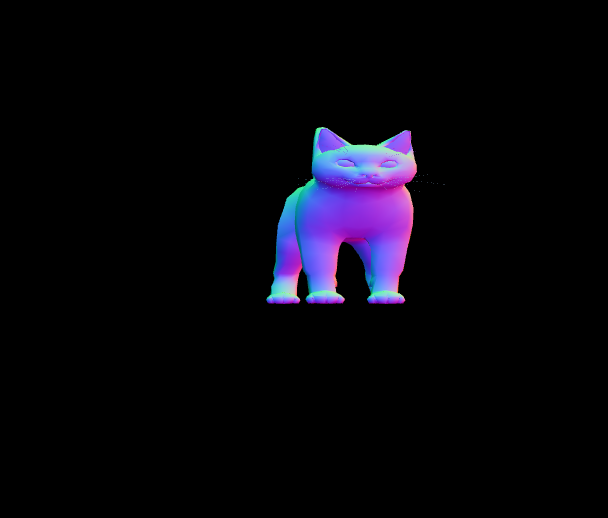
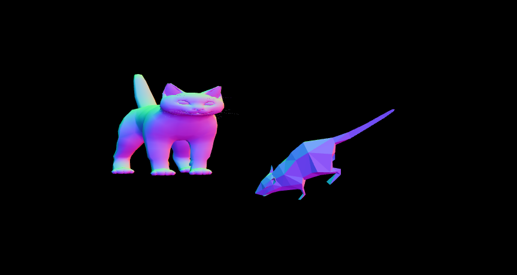

# Trabalho de CG 2018/1

## Descrição:
Este repositório é o projeto da disciplina de **Computação Gráfica** (atualmente referente à fase 1) do ano de 2018 do curso **CC-So - Ciência da Computação** da **UFSCar** - campus Sorocaba.

## Integrantes:
- João Paulo Bologna - 609684
- João Paulo Franscisco de Paula - 587370
- Matteus Takeshi Dias - 587400

## Objetivo:
Fase 1: Nesta fase, um objeto 3D (optamos por um gato obeso), de tamanho ideal para o volume de visão, é exibido na tela, conforme ilustrado:

Fase 2: Nesta fase foi inserido um novo objeto 3D (optamos por um rato), realizado transformação de escala e rotação dos objetos, além da implementação de deslocamento da câmera ao redor dos objetos, conforme ilustrado:

## Implementação:
O código foi feito em JavaScript, com auxílio da API [Three.js] (a qual facilita o trabalho com objetos 3D).

Inicialmente nosso objeto foi baixado do site [Free3D] e posteriormente convertido para json.

Para permitir uma melhor visualização do objeto, foi aplicado redimensionamento e implementada uma rotação com velocidade constante.

É possivel realizar a rotação de um objeto (o gato) pelo teclado utilizado: A, S, D, W.

## Como executar:
Para rodar o projeto é necessário que o navegador permita a execução de arquivo externo à pagina HTML (necessário para carregar o objeto).

Siga os passos listados abaixo, em seu navegador de preferência:

### No Mozilla Firefox:
- Digite na barra de endereço: about:config
- Configure o parâmetro "security.fileuri.strict_origin_policy" para "false"
- Abra o arquivo index.html que está na raiz do projeto

### No Google Chrome:
- Feche todas as instâncias abertas.
- no Windows execute o comando: chrome --allow-file-access-from-files
- no Linux execute o comando: google-chrome --allow-file-access-from-files
- Abra o arquivo index.html que está na raiz do projeto

[Three.js]: <https://threejs.org/>
[Free3D]: <https://free3d.com/>
